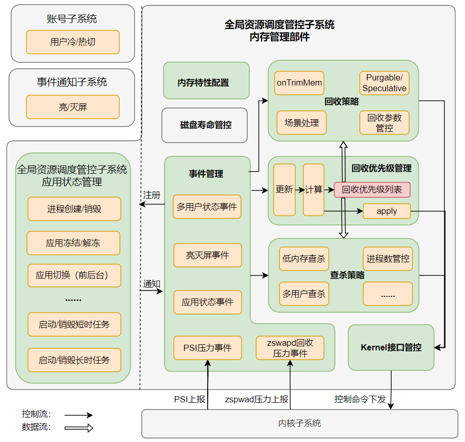

# 内存管理部件

-   [简介](#section_introduction)
-   [目录](#section_catalogue)
-   [框架](#section_framework)
    -   [进程回收优先级列表](#section_prio)
    -   [回收策略/查杀策略](#section_reclaim)
-   [使用说明](#section_usage)
-   [相关仓](#section_projects)

## 简介<a name="section_introduction"></a>

内存管理部件位于全局资源调度管控子系统中，基于应用的生命周期状态，更新进程回收优先级列表，通过内存回收、查杀等手段管理系统内存，保障内存供给。

## 目录<a name="section_catalogue"></a>

```
/foundation/resourceschedule/memmgr
├── common           						# 部件通用工具类
│   ├── include
│   │   ├── kernel_interface.h				# 封装了与Kernel交互的接口
│   │   ├── memmgr_log.h					# 封装了hilog，用于日志打印
│   │   └── single_instance.h				# 封装了单例模式的类模板
│   └── src
│       └── kernel_interface.cpp
│
|
├── sa_profile       						# 组件服务配置
|
├── services         						# 组件服务实现
|   └── memmgrservice    					# 对内接口目录
|       ├── include
|       |   ├── event						# 事件注册中心目录
|       |   ├── reclaim_priority_manager	# 进程回收优先级管理目录
|       |   ├── reclaim_strategy			# 回收策略目录
|       |   └── kill_strategy				# 查杀策略目录
|       └── src
|           ├── event
|           ├── reclaim_priority_manager
|           ├── reclaim_strategy
|           └── kill_strategry
|
└── test 									# 自测试用例目录
```
## 框架<a name="section_framework"></a>

内存管理部件主要基于事件触发回收优先级更新，并基于回收优先级管理内存回收和查杀，其框架如下所示（下图虚线右侧为本部件），主要分为如下几个模块：

1、事件管理模块：统筹管理本部件所要对外响应的事件。主要功能为调用其他子系统提供的接口注册事件监听，并将事件通知到回收优先级管理模块、回收策略模块和查杀策略模块。

2、回收优先级管理模块：基于事件管理模块的应用和用户的事件通知，给出进程的回收和查杀的先后顺序列表，并向回收策略和查杀策略提供查询此列表的接口。

3、回收策略模块：根据回收优先级列表，调整回收内存水线、文件页/匿名页回收比例、压缩/换出比例等回收参数，以及协调不同回收机制协同工作，保障内存中低负载下的供给性能。

4、查杀策略模块：作为回收的逻辑末端，根据回收优先级列表，保障内存重负载下的内存供给。

5、Kernel接口管控模块：负责将回收参数、查杀等管控命令下发到Kernel。

6、内存特性配置：读取回收策略模块、查杀策略模块等需要的配置文件。

7、磁盘寿命管控（规划中）：控制磁盘写入量，以保障磁盘寿命。



### 进程回收优先级列表<a name="section_prio"></a>

进程回收优先级列表，提供了进程间回收和查杀的先后顺序列表。本部件定义的进程回收优先级及其对应的描述如下表所示：

| 优先级                                                                                   | 描述     |
|------------------------------------------------------------------------------------------|-------------|
| -1000 | 系统进程，属于该优先级的进程不会被查杀策略查杀，支持白名单配置。 |
| -800 | 常驻进程，属于该优先级的进程可以被查杀，但优先级较低，且被杀后可以再被拉起，支持白名单配置。 |
| 0 | 前台应用。 |
| 100 | 正在进行后台短时任务的应用; 或者有被进程关联的extension进程 |
| 200 | 后台可感知应用，如正在执行导航、播放音乐等长时任务的应用。 |
| 260 | 连接着分布式设备的后台应用。 |
| 300 | 无被任何进程关联的extension进程。 |
| 400 | 普通后台应用。 |


### 回收策略/查杀策略<a name="section_reclaim"></a>

查杀作为回收的逻辑末端，与回收策略一脉相承，因此两者使用相同的进程回收优先级列表，同时也要协同管控，协调两者触发时机，共同保障不同内存负载下的内存供给功能和性能。

- **回收策略**：回收策略是垂直内存管理的重中之重。回收策略管控了多种不同的内存回收机制，需要协调好不同机制，例如Purgeable/Speculative内存（规划中）的回收要先于其他内存，再例如回收触发时机要先于低内存查杀。

  在内存低负载时，可以将热点文件cache在内存中以提升性能（规划中）。

  内存中负载时，配置kswapd/zswapd等回收进程的内存水线（阈值）以及相应的回收参数，指导kswapd/zswapd工作。

  对于如下单点关键事件，例如大内存需求的相机场景，可以通过“场景处理”模块单点配置，根据业务需求预回收（规划中）；再例如查杀场景，要停止kswapd/zswapd的基本动作，避免无效回收。

- **查杀策略**：查杀主要负责内存重负载场景。由内存压力事件（ Pressure Stall Information ）触发，根据查杀内存水线，从进程回收优先级列表中选择低优先级进程进行清理。

  默认的查杀内存水线与可杀进程回收优先级对应关系如下表所示。未来，系统开发者和产品开发者可以根据内存RAM（Random Access Memory）规格、屏幕尺寸等需求通过修改xml配置修改该对应关系（xml配置暂不支持，规划中）。

  | 查杀内存水线 | 进程回收优先级 |
  | ------------ | -------------- |
  | 500 MB       | 400            |
  | 400 MB       | 300            |
  | 300 MB       | 200            |
  | 200 MB       | 100            |
  | 100 MB       | 0              |


## 使用说明<a name="section_usage"></a>

系统开发者可以通过配置productdefine/common/products下的产品定义json文件，增加或移除本部件，来启用或停用本部件。

` "resourceschedule:memmgr":{} `

## 参数配置说明<a name="section_usage"></a>

产品可通过memmgr_config.xml来配置本模块相关参数，路径为/etc/memmgr/memmgr_config.xml
xml样例:
<?xml version="1.0" encoding="UTF-8"?>
<Memmgr>
	<reclaimConfig>
		<availbufferSize>
			<availBuffer>800</availBuffer>
			<minAvailBuffer>750</minAvailBuffer>
			<highAvailBuffer>850</highAvailBuffer>
			<swapReserve>200</swapReserve>
		</availbufferiSize>
		<ZswapdParam id="1">
			<minScore>0</minScore>
			<maxScore>500</maxScore>
			<mem2zramRatio>60</mem2zramRatio>
			<zran2ufsRation>10</zran2ufsRation>
			<refaultThreshold>50</refaultThreshold>
	</ZswapdParam>
		<ZswapdParam id="2">
			<minScore>501</minScore>
			<maxScore>1000</maxScore>
			<mem2zramRatio>70</mem2zramRatio>
			<zran2ufsRation>20</zran2ufsRation>
			<refaultThreshold>60</refaultThreshold>
		</ZswapdParam>
	</reclaimConfig>
	<killConfig>
	</killConfig>
	<nandlife>
		<dailySwapOutQuotaMB>50</dailySwapOutQuotaMB>
		<totalSwapOutQuotaMB>199</totalSwapOutQuotaMB>
	</nandlife>
</Memmgr>

功能参考:
	详见Enhanced SWAP特性介绍
	https://gitee.com/openharmony/docs/blob/master/zh-cn/device-dev/kernel/kernel-standard-mm-eswap.md

节点介绍:
Memmgr			Memmgr相关配置
	reclaimConfig		内存回收相关配置
		availbufferSize 	系统水线相关配置
			节点功能:avail_buffers接口用于设置buffer区间[min_avail_buffers, high_avail_buffers]，当检测到当前的buffer低于min_avail_buffers时则会唤醒zswapd进行匿名页回收，期望的回收量为high_avail_buffers与当前系统buffer值的差值，实际可能会因为无法回收等原因而未回收那么多内存。avail_buffers为期望的内存正常状态buffer值，free_swap_threshold则是设置交换分区空闲容量的阈值
			默认值(未开启zram时):
				avail_buffers: 0
				min_avail_buffers: 0
				high_avail_buffers: 0
				free_swap_threshold: 0
			默认值:
				avail_buffers: 800
				min_avail_buffers: 750
				high_avail_buffers: 850
				free_swap_threshold: 200

			限制:
				0<=min_avail_buffers<=avail_buffers<=high_avail_buffers<=memTotal
				0<=free_swap_threashold<=memTotal
		ZswapdParam:		memcg相关配置
			节点功能:设置memcg的相关配置。memcg的appScore发生变化时，根据新的appScore找到minScore和maxScore对应区间的ratio值，ub_mem2zram_ratio为内存压缩到ZRAM的比率，ub_zram2ufs_ratio为ZRAM换出到ESwap的比率，refault_threshold为refault的阈值，可通过调整比率来控制ZRAM压缩以及ESwap换出情况。
			默认值:
				minScore: 0
				maxScore: 1000
				mem2zramRatio: 60
				zran2ufsRation: 10
				refaultThreshold: 50
			限制:
				0<=minScore<=1000
				0<=maxScore<=1000
				0<=ub_mem2zram_ratio<=100
				0<=ub_zram2ufs_ratio<=100
				0<=refault_threshold<=100
	killConfig:		内存查杀相关配置
	nandlife:		寿命管控相关配置
		dailySwapOutQuotaMB：每日换出量限制（单位MB），应为正数
		totalSwapOutQuotaMB：总换出量限制（单位MB），应为正数
		两者同时设为0，代表放开换出量限制。厂商可根据器件容量等规格参数，设置合适的值。

## 相关仓<a name="section_projects"></a>

全局资源调度子系统

resource_schedule_service


